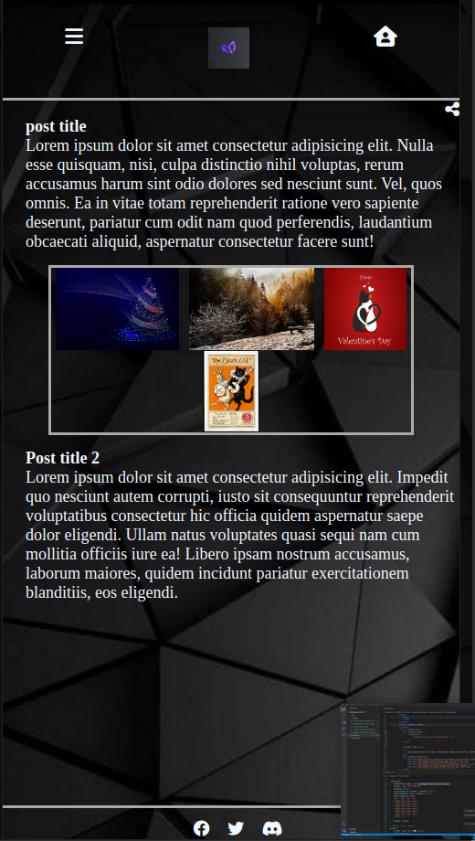
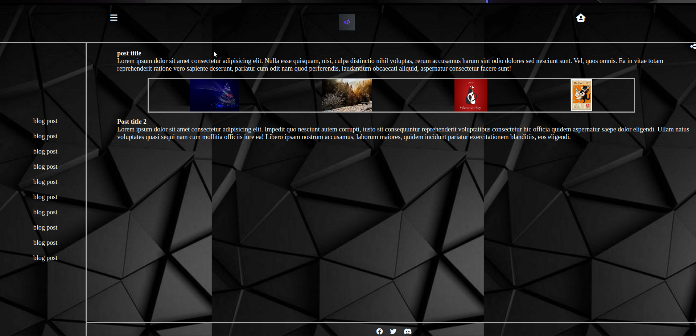

## Badges

# Personal Blog website

This project was building a mobile first personal blog website that uses HTML, CSS, Grid, and Flexbox

## 🚀 About Me
I'm a full stack developer...

## Screenshots

## Contributing

Contributions are always welcome!

